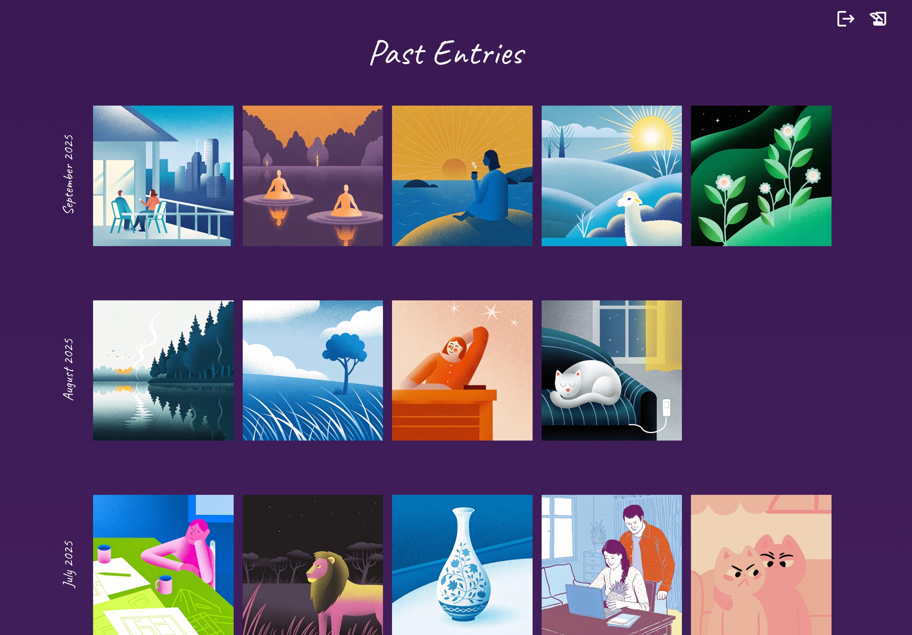

# A new way of journaling

[](https://opensource.org/licenses/MIT)
[](https://nodejs.org/)
[](https://vercel.com/)

A modern journaling application that gets you reflecting deeper by generating personal, context-aware follow-up questions. Next to that, the styling of the journal is made to make the practice of journaling more joyous. 

<p align="center">
  
  
</p>


### How does it work

You start by typing how your day went. The goal is to just let you type, remove the hurdle of phrasing it a certain way, don't think too much about it (when you're done, use command + Enter to submit).
The AI journal will pick up on it and have a small chat conversation with you. The goal is to let you reflect a bit deeper on your day. Throughout this chat, the journal will ask 3 questions:
- the first question lets you go deeper into one aspect of your day. This will be done by asking one of 4 types of questions: reframer, challenger, meta-reflector, or deepener question.
- the second and third question are designed to make you zoom out, think out of the box and get you out of your initial train of thought. They will be 2 (randomly chosen) out of these categories: environments & places, gratitude & highlights, imagination & metaphors, learning & growing, micromoments & joys, people & relationships, senses & embodiment. 

After reflecting and answering these questions, a prompt for an accompanying image will be proposed. You can change the prompt, and when you're ready, click "generate image". The journal entry will be saved with this image.

### A background that changes throughout the day

Your brain feels different throughout the day, and so should your journal. The colors of the journal will move together with the colors of the sky. In the morning, the colors are blue, during sunset it's pink, and at night it's dark purple. 
<p align="center">
  
  
  
</p>


## Installation

### Prerequisites

Before you begin, ensure you have the following installed:
- **Node.js** (v18 or higher) - [Download here](https://nodejs.org/)
- **Git** - [Download here](https://git-scm.com/)
- **Vercel CLI** - [Install with `npm install -g vercel`](https://vercel.com/docs/cli)
- **Vercel Account** - [Sign up here](https://vercel.com/)
- **Openrouter API key** - [Sign up here](https://openrouter.ai/)
- **Recraft API key** - [Sign up here](https://www.recraft.ai/)
- **Langfuse Account** (Required for LLM tracing) - [Sign up here](https://cloud.langfuse.com/)

### Local Development

1. **Clone the repository**
   ```bash
   git clone https://github.com/yourusername/ai-journal.git
   cd ai-journal
   ```

2. **Install dependencies**
   ```bash
   # Install backend dependencies
   npm install
   
   # Install frontend dependencies
   cd frontend
   npm install
   cd ..
   ```

3. **Set up environment variables**
   ```bash
   # Copy the example environment file
   cp .env.example .env
   ```
   
   Edit the `.env` file with your actual API keys and secrets. See `.env.example` for the required variables.

4. **Initialize Langfuse prompts** (First-time setup only)
   ```bash
   # Option 1: Run directly
   node api/scripts/init-langfuse-prompts.js
   
   # Option 2: Use npm script
   cd api && npm run init-prompts
   ```
   
   This script uploads all journaling prompts to your Langfuse account. You only need to run this once during initial setup. After this, you can edit and manage all prompts directly in your Langfuse dashboard.

5. **Run the development server**
   ```bash
   # Start the full-stack application with Vercel
   vercel dev
   ```

6. **Access the application**
   - Application: http://localhost:3000
   - The Vercel dev server will handle both frontend and backend routing

### Vercel Deployment

1. **Install Vercel CLI**
   ```bash
   npm install -g vercel
   ```

2. **Deploy to Vercel**
   ```bash
   vercel
   ```

3. **Set environment variables in Vercel**
   - Go to your Vercel dashboard
   - Select your project
   - Go to Settings → Environment Variables
   - Add the same variables from your `.env` file

4. **Initialize Langfuse prompts** (First-time setup only)
   ```bash
   # Option 1: Run directly
   node api/scripts/init-langfuse-prompts.js
   
   # Option 2: Use npm script
   cd api && npm run init-prompts
   ```
   
   Run this before your first deployment to upload all prompts to Langfuse.

5. **Configure Vercel Blob Storage**
   - In your Vercel dashboard, go to Storage
   - Create a new Blob store
   - Copy the `VERCEL_BLOB_READ_WRITE_TOKEN` to your environment variables

6. **Deploy**
   ```bash
   vercel --prod
   ```

Your AI Journal will be live at your Vercel URL!
